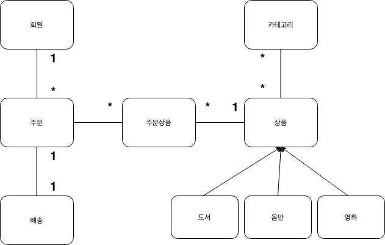

# 11장 웹 애플리케이션 제작


## 프로젝트 환경설정


스프링 MVC와 하이버네이트를 사용하고, 테스트 프레임워크로는 Junit을 사용한다.

여기서는 메이븐 의존성만 살펴보도록 한다.


`pom.xml`

````xml
<!-- 스프링 MVC -->
<dependency>
	<groupId>org.springframework</groupId>
  <artifaceId>spring-webmvc</artifaceId>
  <version>4.1.6.RELEASE</version>
</dependency>

<!-- 스프링 ORM -->
<dependency>
	<groupId>org.springframework</groupId>
  <artifaceId>spring-orm</artifaceId>
  <version>4.1.6.RELEASE</version>
</dependency>

<!-- JPA, 하이버네이트 -->
<dependency>
	<groupId>org.hibernate</groupId>
  <artifaceId>hibernate-entitymanager</artifaceId>
  <version>4.3.10.Final</version>
</dependency>

<!-- H2 DB -->
<dependency>
	<groupId>com.h2database</groupId>
  <artifaceId>h2</artifaceId>
  <version>1.4.187</version>
  <scope>runtime</scope>
</dependency>

<!-- 커넥션 풀 -->
<dependency>
	<groupId>org.apache.tomcat</groupId>
  <artifaceId>tomcat-jdbc</artifaceId>
  <version>7.0.57</version>
  <scope>compile</scope>
</dependency>

<!-- WEB -->
<dependency>
	<groupId>javax.servlet</groupId>
  <artifaceId>jstl</artifaceId>
  <version>1.2</version>
  <scope>runtime</scope>
</dependency>
<dependency>
	<groupId>javax.servlet</groupId>
  <artifaceId>javax.servlet-api</artifaceId>
  <version>3.1.0</version>
  <scope>provided</scope>
</dependency>
<dependency>
	<groupId>javax.servlet</groupId>
  <artifaceId>javax.servlet.jsp-api</artifaceId>
  <version>2.3.1</version>
  <scope>provided</scope>
</dependency>

<!-- 로깅 SLF4J & LogBack -->
<dependency>
	<groupId>org.slf4j</groupId>
  <artifaceId>slf4j-api</artifaceId>
  <version>1.7.6</version>
  <scope>compile</scope>
</dependency>
<dependency>
	<groupId>ch.qos.logback</groupId>
  <artifaceId>logback-classic</artifaceId>
  <version>1.1.1</version>
  <scope>runtime</scope>
</dependency>

<!-- 테스트 -->
<dependency>
	<groupId>org.springframework</groupId>
  <artifaceId>spring-test</artifaceId>
  <version>4.1.6.RELEASE</version>
  <scope>test</scope>
</dependency>
<dependency>
	<groupId>junit</groupId>
  <artifaceId>junit</artifaceId>
  <version>4.12</version>
  <scope>test</scope>
</dependency>
````


핵심 라이브러리

- 스프링 MVC
  - 스프링 MVC 관련
- 스프링 ORM
  - 스프링과 JPA 연동
- JPA, 하이버네이트
  - JPA와 하이버네이트 관련


기타 라이브러리

- H2 데이터베이스
  - TEST, 학습용 DB
- 커넥션 풀
  - tomcat-jdbc 커넥션 풀
- WEB
  - 서블릿, JSP 관련 라이브러리
- SLF4J & LogBack
  - Log4j에 비해 성능과 기능이 향상된 라이브러리
- 테스트
  - 테스트 관련


> 하이버네이트 4.3 버전 부터 JPA2.1 명세를 지원한다.


## 도메인 모델과 테이블 설계


### 요구사항

- 회원 기능
  - 회원 등록
  - 회원 조회
- 상품 기능
  - 상품 등록
  - 상품 조회
  - 상품 수정
- 주문 기능
  - 상품 주문
  - 주문 내역 조회
  - 주문 취소
- 기타 요구사항
  - 상품의 종류는 도서, 음반, 영화가 있다.
  - 상품을 카테고리로 구분할 수 있다.
  - 상품 주문 시 배송 정보를 입력할 수 있다.


### 도메인 모델 설계





#### 회원, 주문, 상품의 관계

- 회원은 여러 상품을 주문할 수 있다.
  - 한 번 주문시 여러 상품을 선택할 수 있기 때문에 주문과 상품은 **다대다 관계** 이다.
  - 다대다 관계를 주문상품이라는 엔티티를 추가해서 해소한다.


#### 상품 분류

- 상품은 도서, 음반, 영화로 구분되며 상품이라는 공통 속성을 사용하기 때문에 **상속 구조** 로 설계


## 엔티티 설계


### 회원 엔티티


````java
@Entity
class Member {
  
  @Id @GeneratedValue
  @Column(name = "member_id")
  private Long id;
  
  private String name;
  
  @Embedded
  private Address address;
  
  @OneToMany(mappedBy = "member")
  private List<Order> orders = new ArrayList<>();
}
````


- 회원 관련 정보들과 주문 상품목록을 가진다.
- 주소는 임베디드 타입은 **Address**


### 주문 엔티티


````java
@Entity
@Table(name = "orders")
class Order {
  
  @Id @GeneratedValue
  @Column(name = "order_id")
  private Long id;
  
 	@ManyToOne(fetch = FetchType.LAZY)
  @JoinColumn(name = "member_id")
  private Member member;
  
  @OneToMany(mappedBy = "order", cascade = CascadeType.ALL)
  private List<OrderItem> orderItems = new ArrayList<>();
  
  @OneToOne(cascade= CascadeType.ALL, fetch = FetchType.LAZY)
  @JoinColumn(name = "delivery_id")
  private Delivery delivery;
  
  private Date orderDate;
  
  @Enumerated(EnumType.STRING)
  private OrderStatus status;
  
  // == 연관관계 메소드 == //
  public void setMember(Member member) {
    this.member = member;
    member.getOrders().add(this);
  }
  
  public void addOrderItem(OrderItem orderItem) {
    orderItems.add(orderItem);
    orderItem.setOrder(this);
  }
  
  public void setDelivery(Delivery delivery) {
    this.delivery = delivery;
    delivery.setOrder(this);
  }
}
````


- 주문 관련 정보(배송정보 포함)와 구매자에 대한 정보를 가지고 있다.
- 주문 상품에 대한 목록을 가지고 있으며, 주문상태가 존재함
- 연관관계 편의 메소드


### 주문상품 엔티티


````java
@Entity
@Table(name = "order_item")
class OrderItem {
  
  @Id @GeneratedValue
  @Column(name = "order_item_id")
  private Long id;
  
  @ManyToOne(fetch = FetchType.LAZY)
  @JoinColumn(name = "item_id")
  private Item item;
  
  @ManyToOne(fetch = FetchType.LAZY)
  @JoinColumn(name = "order_id")
  private Order order;
  
  private int orderPrice;
  private int count;
}
````


- 주문 상품에 대한 정보를 가지고 있다.
- 주문하는 시점에 대한 상품정보의 스냅샷을 가지고 있다.
  - 주문이 끝난상태에서 상품 가격을 수정했을때 변동되어서는 안된다.
